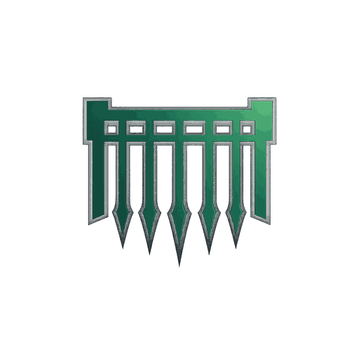
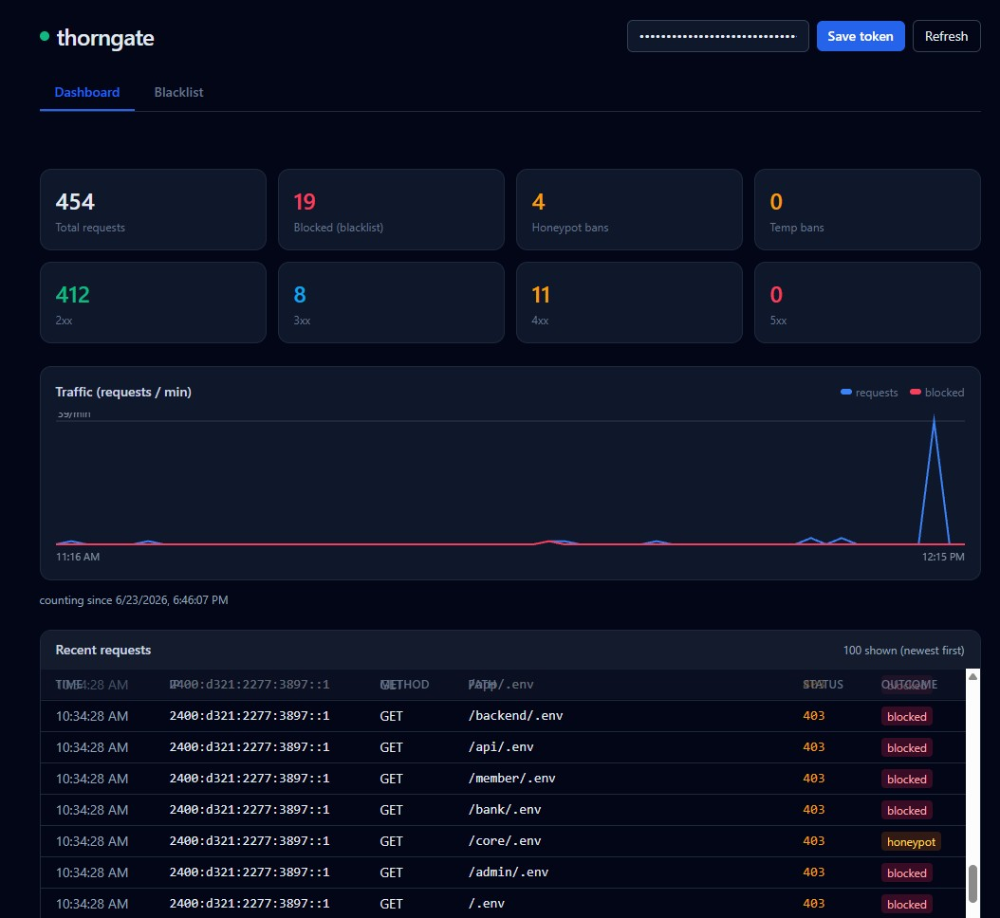

<p align="center">
  
</p>

# thorngate

A tiny, zero-dependency Go reverse-proxy WAF that sits behind a **Cloudflare Tunnel** and in front of your web/API services — a gate at the mouth of the tunnel that snags intruders. It:

- Reverse-proxies configured **path prefixes → internal upstreams** (k8s services or raw IPs), including **WebSocket / SignalR** (protocol-upgrade) connections.
- Treats configured patterns as **honeypots**. Any external IP that matches one is **blacklisted instantly** and gets `403` on every future request.
- Resolves the real external IP from Cloudflare's `Cf-Connecting-Ip` header.
- Persists the blacklist to disk so it survives restarts.

Standard library only — no modules to fetch, `go build` works offline. Default listen port: **8765**.

## Request flow

```
Internet → Cloudflare → cloudflared (tunnel) → thorngate (this) → your app(s)
```

1. Read client IP from `Cf-Connecting-Ip`.
2. If IP is blacklisted → `403`.
3. If the path matches a honeypot → blacklist the IP, persist, `403`.
4. Otherwise proxy to the upstream with the longest matching path prefix.

`/healthz` is reserved for k8s probes (never proxied, never a honeypot).

## Repository layout

```
.
├── cmd/thorngate/        # main entrypoint
├── internal/
│   ├── config/           # config load + honeypot matchers (+ tests)
│   ├── blacklist/        # thread-safe, file-persisted blocklist
│   ├── monitor/          # per-IP sliding-window strike counter (temp bans)
│   ├── history/          # bounded per-IP request history (dumped on ban)
│   ├── stats/            # in-memory traffic counters for the dashboard
│   ├── admin/            # token-protected admin API + web page
│   └── proxy/            # IP extraction, honeypot check, host routing
├── deploy/k3s/           # k3s manifests (ConfigMap, PVC, Deployment, Service)
├── .github/workflows/    # ci.yml (build/vet/test) + release.yml (GHCR image)
├── Dockerfile            # distroless, multi-arch
└── config.json           # example config
```

## Config (`config.json`)

| field | meaning |
|-------|---------|
| `listen` | listen address, default `:8765` |
| `client_ip_header` | header with the real IP — `Cf-Connecting-Ip` for Cloudflare |
| `blacklist_file` | where to persist blocked IPs (mount a volume in k8s) |
| `whitelist` | IPs/CIDRs never blacklisted (your own IP, internal ranges) |
| `honeypots` | patterns that trigger an instant blacklist (see below) |
| `upstream` | **default** internal target for all traffic (IP / host:port / URL) |
| `routes` | optional `host` → `upstream` overrides (see Routing below) |
| `temp_ban` | optional auto-ban for too many bad responses (see below) |
| `admin` | optional token-protected admin API + web page (see below) |
| `request_log` | per-IP request history dumped to the log on blacklist (on by default, see below) |
| `stats` | in-memory traffic counters for the admin dashboard (on by default, see below) |

### Honeypot matching

A honeypot is either a **bare string** (prefix match) or an **object** with a `match` mode:

```json
"honeypots": [
  "/wp-admin",                                       // prefix (boundary-aware)
  { "pattern": ".php",  "match": "contains" },       // block ANY path containing .php
  { "pattern": ".env",  "match": "suffix" },         // any path ending in .env
  { "pattern": "/cgi-bin/*", "match": "glob" },      // shell-style glob (path.Match)
  { "pattern": "\\.(git|svn|hg)(/|$)", "match": "regex" }
]
```

| `match` | semantics |
|---------|-----------|
| `prefix` (default) | path starts with pattern, on a `/` boundary (`/api` ≠ `/apixyz`) |
| `contains` | pattern appears anywhere in the path — e.g. `.php` |
| `suffix` | path ends with pattern |
| `glob` | `path.Match` against the full path (`*` does **not** cross `/` — use `contains`/`suffix` for "anywhere") |
| `regex` | Go `regexp` against the full path |

### Routing

All traffic is proxied to the single default `upstream`. `routes` are **optional** hostname overrides — a request whose `Host` matches a route goes to that route's upstream, everything else falls through to the default.

```json
"upstream": "10.0.0.10:8080",
"routes": [
  { "host": "api.example.com",            "upstream": "10.0.0.5:3000" },
  { "host": "*.internal.example.com",     "upstream": "10.0.0.6:9000" }
]
```

- Upstream values accept an **IP**, **host:port**, or **full URL** — scheme defaults to `http` (`10.0.0.5:3000` → `http://10.0.0.5:3000`).
- `host` matches the request `Host` header (case-insensitive, port ignored).
- A leading `*.` is a wildcard: `*.example.com` matches `a.example.com` and `a.b.example.com`, but **not** the apex `example.com` (add an explicit route for that).

If you only need a single backend, just set `upstream` and omit `routes` entirely.

**Protocol upgrades** (WebSocket, SignalR) pass through transparently — thorngate hijacks the connection and hands it to the upstream, so long-lived bidirectional streams work without extra config. Upgraded connections are recorded as a `101` status for temp-ban/history accounting.

### Temporary bans (`temp_ban`)

Honeypots are an *instant, permanent* ban. `temp_ban` is the softer, optional layer: it watches the **response codes** your upstreams return and **temporarily** blacklists an IP that produces too many bad ones — e.g. a scanner racking up 404s.

```json
"temp_ban": {
  "enabled": true,
  "status_codes": [401, 403, 404, 429],
  "max": 20,
  "window": "1m",
  "ban_duration": "15m"
}
```

| field | meaning | default |
|-------|---------|---------|
| `enabled` | turn the feature on | `false` |
| `status_codes` | which response codes count as "bad" | `[401, 403, 404, 429]` |
| `max` | bad responses allowed within `window` before a ban | `20` |
| `window` | sliding counting window (Go duration) | `"1m"` |
| `ban_duration` | how long the temporary ban lasts (Go duration) | `"15m"` |

- Bans **auto-expire** after `ban_duration` (lazily removed on the next request, and dropped on restart if already lapsed).
- Whitelisted IPs are never temp-banned; a honeypot (permanent) ban always outranks a temporary one.
- Omit the whole `temp_ban` block to disable it (zero overhead — responses aren't even wrapped).

### Request history on blacklist (`request_log`)

When an IP trips a honeypot (or a temp-ban), the requests it made *just before* getting blocked are often the most useful signal — the recon and probing that led up to the trap. Thorngate keeps a short, in-memory ring buffer of the last few requests each client IP made while it was still allowed through, and dumps them to the log the moment that IP is blacklisted:

```
BLACKLISTED ip=9.9.9.9 honeypot=/wp-admin ua="curl/7.64.1" total=6
  history ip=9.9.9.9 reason=honeypot 1/3 at=2026-06-14T12:34:55Z method=GET host="app.example.com" path="/" query="" status=200 ua="curl/7.64.1"
  history ip=9.9.9.9 reason=honeypot 2/3 at=2026-06-14T12:34:56Z method=GET host="app.example.com" path="/robots.txt" query="" status=404 ua="curl/7.64.1"
  history ip=9.9.9.9 reason=honeypot 3/3 at=2026-06-14T12:34:57Z method=GET host="app.example.com" path="/.env" query="" status=404 ua="curl/7.64.1"
```

It is **on by default** with sensible bounds — disable or tune it with a `request_log` block:

```json
"request_log": {
  "disabled": false,
  "depth": 10,
  "max_ips": 4096,
  "ttl": "15m"
}
```

| field | meaning | default |
|-------|---------|---------|
| `disabled` | turn the feature off entirely (zero overhead) | `false` |
| `depth` | how many recent requests to keep per IP | `10` |
| `max_ips` | cap on distinct IPs tracked; least-recently-active is evicted past this | `4096` |
| `ttl` | drop history for IPs idle longer than this (Go duration) | `"15m"` |

- Every request that reaches an upstream is recorded (any response code), so probing that returned `404`/`401` — usually the telling part — is captured too. The honeypot request itself isn't proxied, so it never appears in its own history.
- Memory is bounded on both axes (`depth` × `max_ips`) and idle IPs are swept on the `ttl` interval, so a flood of distinct sources can't exhaust memory. An IP's history is freed immediately once it's been logged.
- History lives in memory only — it is **not** persisted to the blacklist file; restart and it's gone.

### Traffic stats (`stats`)

thorngate keeps lightweight in-memory counters so the admin **Dashboard** can show traffic at a glance: total requests, requests blocked by the blacklist, honeypot bans, temp-bans, and a 2xx/3xx/4xx/5xx breakdown of proxied responses, plus a per-minute requests-vs-blocked chart and a **live feed of recent requests** (time, IP, method, path, status, and outcome — `proxied` / `blocked` / `honeypot`).

It is **on by default** — the headline totals are lock-free atomics and the time series is a small per-minute ring buffer, so the overhead is a few increments per request. Disable or tune it with a `stats` block:

```json
"stats": {
  "disabled": false,
  "window_minutes": 60,
  "recent_requests": 100
}
```

| field | meaning | default |
|-------|---------|---------|
| `disabled` | turn the feature off entirely (zero overhead; the dashboard reports stats as off) | `false` |
| `window_minutes` | how many minutes the traffic-over-time chart covers | `60` |
| `recent_requests` | how many recent requests to keep in the live feed (IP + path + outcome); set negative to omit the feed | `100` |

- Counters live in memory only — they are **not** persisted and reset to zero on restart.
- Read them programmatically via `GET /admin/stats` (same bearer token as the rest of the admin API).

### Managing the blacklist (`admin`)

An optional admin endpoint on a **separate port** lets you view, add, and remove blocked IPs live (changes hit the in-memory store and are persisted immediately — no restart). It serves both a JSON API and a single self-contained web page. The page has two tabs: a **Dashboard** with traffic stats (see `stats` below) and the **Blacklist** manager. It auto-refreshes every 10s and styles itself with [Tailwind](https://tailwindcss.com) via the Play CDN — the page is loaded in your own browser over the port-forward, so the CDN fetch happens browser-side; the thorngate binary itself stays dependency-free and offline-buildable.

<p align="center">
  
</p>

```json
"admin": {
  "enabled": true,
  "listen": ":9000",
  "token": "change-me-locally"
}
```

- `token` is required as `Authorization: Bearer <token>` on every API call. Leave it empty in the config to read it from the **`THORNGATE_ADMIN_TOKEN`** env var instead (the k8s manifest wires this from a Secret).
- **Keep this port cluster-internal — never attach it to the Cloudflare tunnel.** In k3s it's a separate ClusterIP `Service` (`thorngate-admin`); reach it with port-forward.

```bash
kubectl -n thorngate port-forward svc/thorngate-admin 9000:9000
# then open http://localhost:9000/admin/ and paste your token
```

API (constant-time token check; the HTML page carries no secret and prompts for the token, storing it in localStorage):

| method | path | body | action |
|--------|------|------|--------|
| `GET` | `/admin/blacklist` | — | list all entries (JSON) |
| `POST` | `/admin/blacklist` | `{"ip":"1.2.3.4","reason":"..."}` | permanently ban an IP or CIDR range |
| `DELETE` | `/admin/blacklist/{key}` | — | unban an IP or CIDR range |
| `GET` | `/admin/stats` | — | traffic counters + per-minute series (JSON; `{"enabled":false}` if stats are off) |
| `GET` | `/admin/` | — | the web page |

The ban key may be a single IP (`1.2.3.4`) or a CIDR range (`1.2.3.0/24`) — a range bans every address it contains, which is useful when an attacker rotates through a subnet. A whitelisted IP is never blocked, even if it falls inside a banned range.

```bash
TOKEN=change-me-locally
curl -H "Authorization: Bearer $TOKEN" localhost:9000/admin/blacklist
curl -H "Authorization: Bearer $TOKEN" -d '{"ip":"1.2.3.4"}' localhost:9000/admin/blacklist
curl -H "Authorization: Bearer $TOKEN" -d '{"ip":"1.2.3.0/24"}' localhost:9000/admin/blacklist
curl -H "Authorization: Bearer $TOKEN" -X DELETE localhost:9000/admin/blacklist/1.2.3.4
```

## Run locally

```bash
go build -o thorngate ./cmd/thorngate
./thorngate -config config.json   # listens on :8765

# simulate a Cloudflare request that trips the ".php contains" honeypot
curl -H "Cf-Connecting-Ip: 9.9.9.9" http://localhost:8765/x/shell.php   # 403, IP now blocked
curl -H "Cf-Connecting-Ip: 9.9.9.9" http://localhost:8765/             # 403 forever

go test ./...   # exercises the matchers
```

## CI / release

- **`ci.yml`** runs `go vet`, `go build`, and `go test` on every push/PR.
- **`release.yml`** builds a multi-arch (amd64 + arm64) image and pushes it to **GHCR** on a `vX.Y.Z` tag (or manual dispatch). Image: `ghcr.io/<owner>/<repo>`. Tag and push to publish:

```bash
git tag v0.1.0 && git push origin v0.1.0
```

## Deploy to k3s

Edit the image ref and your upstream service names in `deploy/k3s/thorngate.yaml`, then:

```bash
kubectl apply -f deploy/k3s/thorngate.yaml
```

The blacklist is stored on a `PersistentVolumeClaim` (k3s `local-path` default StorageClass). Runs as a single replica with the `Recreate` strategy because the store is in-memory + a local file. The image is multi-arch, so it runs on amd64 and arm64 (e.g. Raspberry Pi) nodes.

### Point cloudflared at it

```yaml
ingress:
  - hostname: example.com
    service: http://thorngate.thorngate.svc.cluster.local:80
  - service: http_status:404
```

cloudflared automatically sets `Cf-Connecting-Ip`, which is how thorngate identifies the real client.

## Security notes

- **Keep the Service `ClusterIP`-only.** Never expose it via LoadBalancer/Ingress. The `Cf-Connecting-Ip` header is trusted, so anything that can reach thorngate directly could spoof it. Because only the in-cluster `cloudflared` can reach a ClusterIP service, the header is trustworthy in this topology.
- Always `whitelist` your own admin IP and internal CIDRs so you can't lock yourself out.

## Scaling beyond one replica

The blacklist is per-pod (in-memory + local file). To run multiple replicas, replace the file store in `internal/blacklist` with a shared backend (Redis `SET`/`SISMEMBER` is a ~30-line swap) so all pods see the same blocklist.
